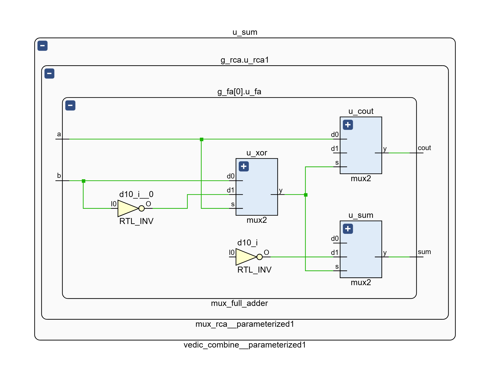
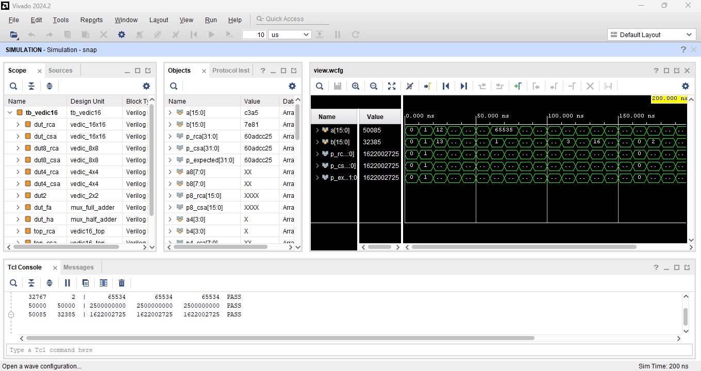
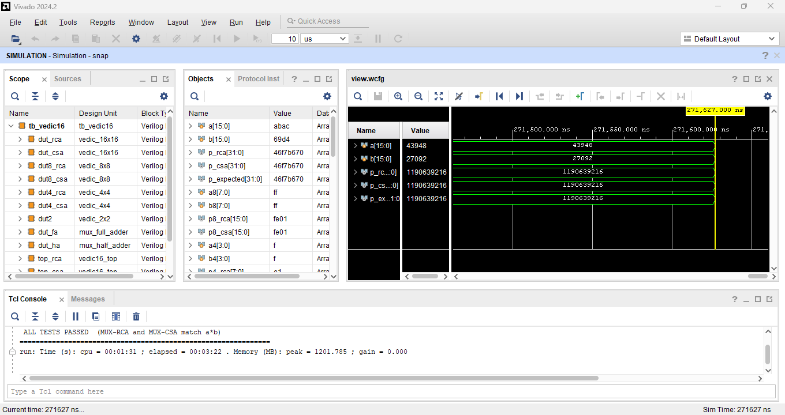
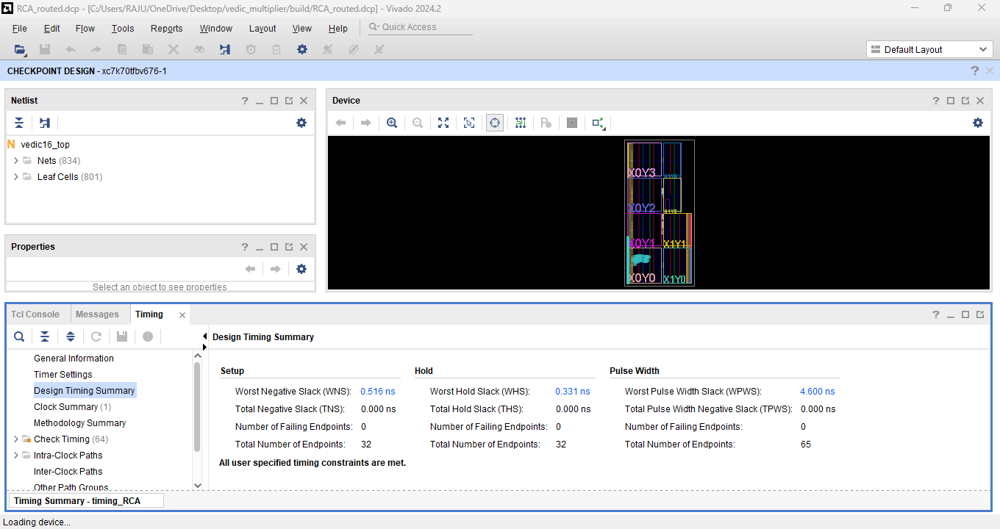
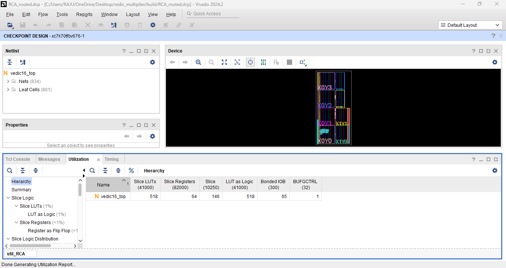

# 16-bit Vedic Multiplier using MUX-Based Adders: Verilog / Vivado implementation

Implementation and FPGA verification of:

> R. Gowrishankar, S. Naveen, V. Selva Mathulika, K. Harini,
> **"Implementation of 16-Bit Vedic Multiplier using MUX-Based Adders"**,
> ICICIT-2026, pp. 438-443, DOI 10.1109/ICICIT69063.2026.11634241

Tools: Vivado 2024.2, Kintex-7 `xc7k70tfbv676-1`

## What the paper proposes, and how it maps to the RTL

| Paper | RTL (`rtl/`) |
|---|---|
| Urdhva Tiryagbhyam (vertical & crosswise) multiplication, 2×2 → 4×4 → 8×8 → 16×16 (Fig. 1, Fig. 2) | `vedic_2x2`, `vedic_4x4`, `vedic_8x8`, `vedic_16x16` in `vedic_multiplier.v` |
| MUX-based full adder, 3 MUXes (Fig. 3) | `mux_full_adder` in `mux_adders.v` (built only from `mux2`) |
| MUX-based ripple-carry adder (Fig. 4) | `mux_rca`; combiner `ADDER="RCA"`: RCA → RCA → half adder → RCA, exactly the Fig. 1 datapath |
| MUX-based carry-save adder (Fig. 5) | `mux_csa`; combiner `ADDER="CSA"`: one 3:2 carry-save layer + final MUX-RCA |
| (reference) | `ADDER="BASE"`: Vivado's own `a*b` in LUTs, for comparison only |

`vedic16_top.v` registers the inputs and the product, so Vivado times the
multiplier as a register-to-register path.



## Folder layout

```
vedic_multiplier/
├── rtl/              mux_adders.v, vedic_multiplier.v, vedic16_top.v
├── tb/               tb_vedic16.v  (self-checking)
├── constraints/      vedic16.xdc   (100 MHz clock, LVCMOS33 I/O)
├── simulation/       sim_log.txt
├── synthesis/        rtl_*.png/.pdf (RTL schematics), synth_netlist_*.png/.pdf
├── reports/          summary.csv + RCA/, CSA/, BASE/ (utilization, timing, critical path, power)
└── screenshots/      Vivado screenshots (simulation, timing, utilization)
```

## Verification: all 266,918 checks pass

`tb/tb_vedic16.v` checks **both** variants against `a*b`, bottom-up:

| Phase | What | Vectors |
|---|---|---|
| 0 | 20 directed vectors (0, 1, FFFF×FFFF, 8000×8000, AAAA×5555, ...) | 20 |
| 1 | MUX half adder / full adder | exhaustive |
| 2 | 2×2, 4×4, 8×8 Vedic blocks, RCA and CSA | exhaustive (8×8 = 65,536 pairs) |
| 3 | 16×16, RCA and CSA | 64 corner pairs, 512 walking-one, 200,000 random |
| 4 | registered `vedic16_top`, 2-cycle latency | 500 |

```
 checks : 266918
 ALL TESTS PASSED  (MUX-RCA and MUX-CSA match a*b)
```

The testbench was also checked against a deliberately injected bug (two carry
bits swapped in the RCA combiner). It reported 67,366 failures and pointed to
the 4×4 level, so it detects real errors.




## Synthesis + implementation results (routed, xc7k70tfbv676-1, 100 MHz)

| | MUX-RCA (paper) | MUX-CSA (paper) | Vivado `a*b` (reference) |
|---|---:|---:|---:|
| Slice LUTs | 518 | **459** | 278 |
| Flip-flops (I/O registers) | 64 | 64 | 64 |
| DSP | 0 | 0 | 0 |
| Timing @ 100 MHz | met, WNS +0.516 ns | met, WNS +1.660 ns | met, WNS +3.170 ns |
| Multiplier path delay | 9.471 ns (14 LUT levels) | **8.293 ns** (13 LUT levels) | 6.828 ns (7 CARRY4 + 6 LUT) |
| Fmax (multiplier path) | 105.4 MHz | **119.9 MHz** | 146.4 MHz |
| Total / dynamic power* | 0.180 / 0.097 W | 0.184 / 0.101 W | 0.173 / 0.090 W |

\* Vivado vectorless estimate, mostly I/O power; not comparable to the paper's µW figures.




## Comparison with the paper

| | Paper (Cadence Virtuoso, 45 nm CMOS) | This work (Vivado, Kintex-7 FPGA) |
|---|---|---|
| Functional correctness | not reported | both variants bit-exact (266,918 checks) |
| MUX-RCA | 137.403 ps, 402.9 µW | 9.47 ns, 518 LUTs |
| MUX-CSA | 433.627 ps, 180.8 µW | 8.29 ns, 459 LUTs |
| Faster variant | RCA | **CSA** |

Notes:

* **The architecture is reproduced and works.** Both MUX-adder variants of the
  16-bit Urdhva Tiryagbhyam multiplier give exact products for every tested input.
* **The speed/power numbers cannot be reproduced on an FPGA.** The paper's
  benefits come from transistor count and switching activity of MUX cells in
  45 nm CMOS. In an FPGA, every MUX is absorbed into 6-input LUTs, so the
  MUX structure does not survive synthesis.
* On the FPGA the **CSA variant is faster and smaller than RCA**, the opposite
  of the paper's delay ranking. The carry-save layer removes two of the three
  ripple chains per level, which matters more than MUX delays once everything
  is LUTs.
* Vivado's plain `a*b` beats both because it uses the dedicated **CARRY4**
  carry chains. The hand-built MUX ripple adders cannot use those chains.
* Inconsistency in the paper: the abstract gives the MUX-RCA delay as
  **187.403 ps**, while Sec. IV-B, Table I and the conclusion give
  **137.403 ps**. The PDP in Table I (5.53×10⁻¹⁴ J) matches 137.403 ps.

## Running it in Vivado

1. Create a new RTL project (part `xc7k70tfbv676-1`).
2. Add `rtl/*.v` as design sources, `tb/tb_vedic16.v` as the simulation source
   and `constraints/vedic16.xdc` as the constraint. Top: `vedic16_top`.
3. **Run Simulation** (run all): the console ends with `ALL TESTS PASSED`.
4. Choose the adder with the `ADDER` generic of `vedic16_top`
   (Settings → General → Generics): `"RCA"`, `"CSA"` or `"BASE"`.
5. **Run Synthesis / Implementation** for schematics and area / timing / power reports.
